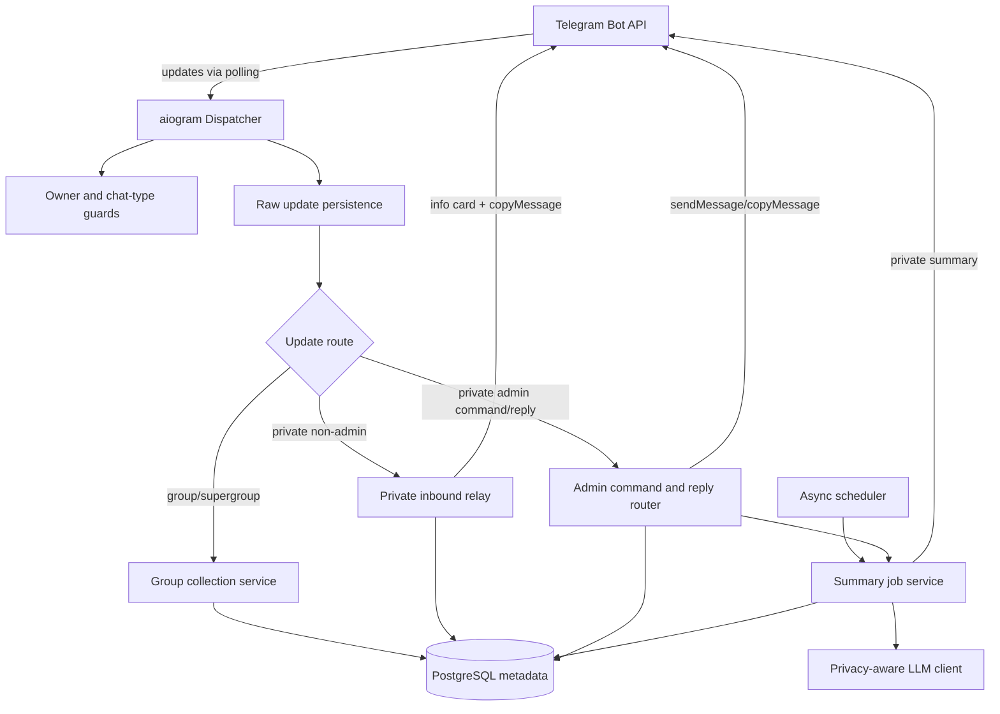
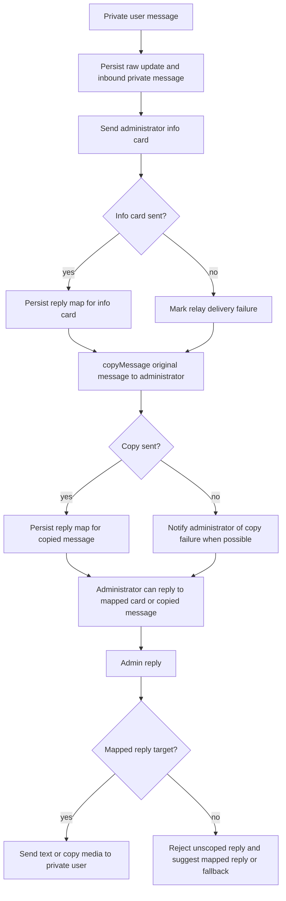

# feat: Build Telegram Summary Relay Bot

## Summary

Build the v1 Telegram Summary Relay Bot as a greenfield Python service: aiogram polling, PostgreSQL-backed raw update and metadata storage, one async scheduler in the polling process, private incremental group summaries with safe cursor advancement, and private-user relay/reply mapping through Telegram message copying.

The plan covers the full upstream brainstorm scope and keeps webhook delivery, Redis/multi-worker scaling, media file-body storage, dashboards, multi-admin workflows, group publication, and current-chat mode out of active implementation.

---

## Problem Frame

The administrator needs one bot that quietly watches multiple Telegram groups, summarizes new group activity privately, and also acts as a privacy-preserving relay between private users and the administrator. The two message intents must stay separate: group messages are summarized and may represent media as placeholders; private messages are conversation content and should preserve Telegram message shape through `copyMessage` where possible.

This is a greenfield repository. Local research found no application source, tests, CI, database schema, or project-specific implementation conventions yet. The upstream requirements document and developer brief are therefore the source of product truth, while official framework documentation shapes the technical plan.

---

## Requirements

**Runtime, configuration, and access**

- R1. The service runs through Telegram Bot API polling in v1 and does not require a public webhook endpoint. Origin R1, F1.
- R2. The service supports exactly one configured administrator, identified by Telegram user ID. Origin R2.
- R3. Every administrator-only action enforces the configured administrator ID server-side. Command menu visibility is not authorization. Origin R3, R35, AE7.
- R4. The same administrator can manage multiple Telegram groups by Telegram `chat_id`. Origin R4.
- R5. Startup validates required configuration and refuses ambiguous modes such as webhook delivery plus polling or multiple polling workers for one bot token. Origin R1; shaped by Telegram and aiogram docs.

**Storage and data boundaries**

- R6. The service persists raw Telegram update JSON with a unique `update_id`, processing status, and error metadata for debugging and replay. Origin R14.
- R7. The database stores group, private-user, message, media, summary, and reply-map metadata but does not store Telegram media file bodies in v1. Origin R15, R16, R17, AE3.
- R8. Raw update payload retention defaults to 30 days and is configurable so sensitive raw Telegram content does not grow unbounded. Origin R18.
- R9. Each async handler and scheduled job uses its own database unit of work/session; sessions are not shared across concurrent tasks. Shaped by SQLAlchemy asyncio docs.

**Group collection and summaries**

- R10. The bot collects group and supergroup messages where it receives updates, keyed by Telegram `chat_id`, while remaining quiet in groups by default. Origin R5, R6, F2.
- R11. Group text messages are included in summary input as text. Origin R11.
- R12. Group media messages are represented for summaries with placeholders such as `[photo]`, `[voice]`, `[document: filename]`, `[video]`, or `[sticker]`, preserving captions where available. Origin R12, AE3.
- R13. Each group has an independent summary cursor that advances only after LLM generation and private Telegram delivery to the administrator both succeed. Origin R7, R10, R13, AE1, AE2.
- R14. The administrator can manually trigger summaries from private chat, for all enabled groups or a specific group. Origin R8, F4.
- R15. Enabled groups can have scheduled summaries with configurable intervals; scheduled and manual paths share the same summary job and cursor rules. Origin R9, F3, F4.
- R16. V1 sends the full unsummarized interval to the LLM in one request; provider failure, timeout, over-limit input, or empty output fails the job without cursor advancement. Origin R13.

**Private relay and administrator replies**

- R17. When a non-admin private user messages the bot, the service records user/message metadata, sends an administrator-visible info card, and uses `copyMessage` where possible so content keeps Telegram message shape. Origin R19, R20, R21, F5, AE4.
- R18. The service creates reply mappings for both the info card and copied message when possible, keyed by administrator chat/message identifiers. Origin R22, AE4, AE5.
- R19. The bot never attempts to initiate private conversations with users who have not interacted with it. Origin R24.
- R20. If copying a private message fails, the service records the failure and notifies the administrator without bypassing Telegram restrictions by downloading or re-uploading protected content. Origin R25.
- R21. The administrator can reply to a mapped info card or copied message to send a response to the correct private user. Origin R26, AE5.
- R22. Text administrator replies are delivered with text sending; media administrator replies are copied where Telegram supports the message type. Origin R27, R28.
- R23. Unscoped ordinary administrator messages are rejected rather than guessed; `/reply <user_id> <message>` is the text fallback for known private users. Origin R29, R30, R31, AE6.

**Command visibility and operational behavior**

- R24. Administrator commands are effective only in the administrator's private chat; owner-issued admin commands in groups do not produce group-visible management responses. Origin R6, R10, R32, R34.
- R25. Normal private users see only user-facing help/start behavior and cannot run administrator commands even if they know the command text. Origin R32, R33, R35, AE7.
- R26. Telegram API failures are recorded with enough context to explain whether summary cursor advancement, relay mapping, or outgoing reply delivery was skipped. Origin R13, R25.
- R27. LLM summary requests use a field whitelist and ordinary logs must not contain raw update JSON, private relay content, Telegram numeric IDs, file IDs, full prompt bodies, or raw provider responses.
- R28. Administrator-visible Telegram text that includes user-controlled or LLM-controlled content follows one rendering policy so Markdown/HTML control characters cannot alter message meaning or break delivery.

---

## Key Technical Decisions

- **Use Python with aiogram 3.x polling for v1:** The developer brief recommends Python/aiogram, and aiogram's long-polling docs explicitly fit bots without a public inbound endpoint. Polling is also aligned with the origin's v1 simplicity goal. Webhook support stays deferred.
- **Fail fast on webhook/polling ambiguity and one-poller violations:** Telegram documents `getUpdates` and webhooks as mutually exclusive, and aiogram notes only one polling process should run for a single bot token. Startup defaults to fail-closed when an active webhook is detected; automatic webhook deletion requires explicit operator configuration and must not drop pending updates by default. The Compose shape should run one polling worker.
- **Use PostgreSQL with SQLAlchemy 2.0 asyncio and Alembic:** PostgreSQL matches the developer brief and gives reliable constraints for `update_id`, reply mappings, per-group summary state, and job state transitions. SQLAlchemy async supports explicit transaction scopes, but `AsyncSession` is mutable and not safe across concurrent tasks, so handlers/jobs create their own sessions.
- **Run polling and scheduling in one async process for v1:** This honors the deferred scope for Redis queues, multi-worker scaling, and webhook delivery. APScheduler's `AsyncIOScheduler` fits an asyncio app; one scheduler instance should own schedules, with coalescing/misfire settings preventing restart catch-up storms. A database-backed per-group lease is the correctness boundary for overlapping summary jobs; scheduler `max_instances` is only a local defense.
- **Persist raw updates before derived side effects, with recovery:** Raw `update_id` persistence is the idempotency gate. If raw update persistence fails, the handler should not proceed to Telegram side effects such as relaying or summary-triggered sends, because that would break replay/debug guarantees. Once raw persistence succeeds, derived handling must be idempotent and recoverable through processing status and side-effect attempt records so a crash after raw commit does not permanently strand the business action.
- **Treat group summary content and private relay content as separate pipelines:** Group media becomes summary placeholders and never downloads file bodies. Private user messages are copied through Telegram when possible and produce reply maps for safe support-style routing.
- **Advance summary cursors with an internal summary-ready sequence after delivery:** A summary job captures a database-backed ingestion cutoff for records already stored for summary, sends the LLM output to the administrator, then advances `summary_state` only if the stored cursor still matches the job's starting cursor. The cursor should use an internal summary-ready sequence or row identifier rather than raw Telegram `message_id` alone, so out-of-order handler commits cannot permanently skip late-committed messages.
- **Make admin reply routing explicit and map-based:** Reply routing uses `(admin_chat_id, admin_message_id)` rather than sender names or recent activity. Current-chat mode remains out of scope because the origin identifies accidental-send risk.
- **Use command scopes only for menu visibility:** `setMyCommands`/command scopes shape what users see, but every handler still checks `OWNER_ID` and chat type. Menu setup failures should warn, not weaken authorization.
- **Centralize Telegram API error handling and rendering:** Telegram method failures expose structured failure information; relay, summary delivery, and admin replies all need shared handling for rate/server failures versus terminal permission/content failures, without implying unbounded delayed retry in v1. All administrator-visible bot text that includes user-controlled or LLM-controlled content must use one rendering policy: either no parse mode by default, or consistent escaping before Markdown/HTML parse mode is enabled.
- **Keep the LLM provider behind a small, privacy-aware client:** The origin requires LLM summaries but does not require a specific provider. The plan creates one concrete provider client boundary with configured model, timeout, prompt version, and a field-whitelisted summary payload. V1 can ship with one provider while preserving cursor-failure semantics; provider registries, plugin loading, multi-provider routing, raw update payloads, private relay content, Telegram numeric IDs, and file IDs stay out of LLM requests.

---

## High-Level Technical Design

### Component topology



### Summary cursor lifecycle

```mermaid
sequenceDiagram
  participant Trigger as Manual command or scheduler
  participant Job as Summary job service
  participant DB as PostgreSQL
  participant LLM as LLM provider
  participant TG as Telegram Bot API
  participant Admin as Administrator chat

  Trigger->>Job: request summary for group
  Job->>DB: create running job if no same-group job is running
  Job->>DB: read current cursor and messages after cursor
  alt no new messages
    Job->>TG: manual trigger tells admin; scheduled trigger stays quiet
    Job->>DB: finish job without cursor movement
  else messages exist
    Job->>LLM: summarize interval with prompt version
    alt LLM fails or output invalid
      Job->>DB: mark failed, cursor unchanged
      Job->>TG: notify admin when possible
    else summary generated
      Job->>TG: send private summary to administrator
      alt delivery succeeds
        Job->>DB: compare starting cursor, advance to interval max message id
        Job->>DB: store result and mark succeeded
      else delivery fails
        Job->>DB: mark failed, cursor unchanged
      end
    end
  end
```

### Private relay and reply map lifecycle



---

## Output Structure

The plan creates a new Python service. The exact file split may adjust during implementation, but the intended layout is:

```text
.
├── pyproject.toml
├── .env.example
├── Dockerfile
├── docker-compose.yml
├── alembic.ini
├── migrations/
├── src/
│   └── summary_relay_bot/
│       ├── main.py
│       ├── config.py
│       ├── db/
│       ├── telegram/
│       ├── handlers/
│       ├── services/
│       ├── scheduler.py
│       └── llm/
├── tests/
│   ├── unit/
│   └── integration/
└── docs/
    └── operations/
```

---

## Implementation Units

### U1. Project scaffold, configuration, and polling startup

- **Goal:** Create the greenfield Python service shell, configuration loading, async app lifecycle, Telegram polling startup, and startup preflight for polling/webhook mode.
- **Requirements:** R1, R2, R5, R9; supports F1.
- **Dependencies:** None.
- **Files:**
  - `pyproject.toml`
  - `.env.example`
  - `Dockerfile`
  - `docker-compose.yml`
  - `src/summary_relay_bot/main.py`
  - `src/summary_relay_bot/config.py`
  - `src/summary_relay_bot/telegram/bot.py`
  - `tests/unit/test_config.py`
  - `tests/integration/test_startup_lifecycle.py`
- **Approach:** Use environment-backed config for bot token, owner ID, database URL, summary defaults, LLM settings, and retention defaults. Initialize one bot, one dispatcher, one database engine/session factory, and later one scheduler in a single async app lifecycle. Startup should make polling mode explicit and fail closed when an active webhook is present, unless an explicit operator opt-in allows deletion with pending updates preserved by default. Secret values must be redacted in config representations, validation errors, startup logs, and test output.
- **Patterns to follow:** No local code patterns exist; follow aiogram long-polling docs for dispatcher startup and keep token/config outside source code.
- **Test scenarios:**
  - Given missing `BOT_TOKEN`, startup config validation fails before creating Telegram or database clients.
  - Given a non-integer or missing owner ID, config validation rejects startup.
  - Given valid config, app construction creates one bot/dispatcher lifecycle and exposes a session factory rather than a global session.
  - Given startup preflight reports an active webhook and no deletion opt-in is configured, startup fails with an operator-visible message and does not call Telegram deletion methods.
  - Given config validation fails or config is logged/repr-rendered, bot token, database password, and LLM key values are redacted.
  - Covers F1. Given startup succeeds, the polling lifecycle registers routers before polling begins.
- **Verification:** The app can be constructed from environment-style config in tests, invalid configuration fails early, and startup preflight behavior is observable without contacting production Telegram.

### U2. Database schema, migrations, and persistence primitives

- **Goal:** Define PostgreSQL persistence for raw updates, groups, messages, private users, private messages, admin reply maps, summary state, summary jobs, summary results, and retention metadata.
- **Requirements:** R4, R6, R7, R8, R9, R18; supports F2, F3, F5, F6 and AE3.
- **Dependencies:** U1.
- **Files:**
  - `alembic.ini`
  - `migrations/env.py`
  - `migrations/versions/20260604_0001_initial_schema.py`
  - `src/summary_relay_bot/db/base.py`
  - `src/summary_relay_bot/db/session.py`
  - `src/summary_relay_bot/db/models.py`
  - `src/summary_relay_bot/db/repositories.py`
  - `tests/unit/test_models.py`
  - `tests/integration/test_persistence.py`
- **Approach:** Model tables from the developer brief with explicit uniqueness and lifecycle constraints: unique raw `update_id`, unique group `chat_id`, unique `summary_state.chat_id`, unique `(admin_chat_id, admin_message_id)` reply maps, one running summary lease per group, idempotency keys for derived group/private messages, and job status values for pending/running/succeeded/failed/blocked. Group messages should have an internal summary-ready sequence or row identifier separate from Telegram `message_id` so cursor advancement follows committed ingestion order. Telegram side-effect attempts for relay and delivery should record pending/sent/mapped/failed state so crash recovery can resume or mark partial failures. Store raw update JSON and derived metadata, but no media file bodies. Provide repository functions that accept a per-task session instead of owning global state.
- **Patterns to follow:** SQLAlchemy asyncio documentation: session factory at app scope, separate `AsyncSession` per handler/job, explicit transaction boundaries.
- **Test scenarios:**
  - Given two inserts with the same Telegram `update_id`, the second insert is idempotently rejected or returns the existing update without creating duplicate derived rows.
  - Given raw update persistence succeeds and the process crashes before derived handling completes, a recovery pass can identify the pending update and rerun idempotent group/private derivation without duplicating Telegram side effects.
  - Given media metadata for a document, the database stores `file_id`, `file_unique_id`, filename, MIME type, size, caption, and message type but no binary file body. Covers AE3.
  - Given two reply maps with the same administrator chat/message ID, the database prevents ambiguous routing.
  - Given summary state for a group, only one state row exists per `chat_id`, and at most one non-expired running summary lease can exist for that group.
  - Given concurrent repository use, each operation receives its own session and no shared session object is reused across tasks.
  - Given group messages commit out of Telegram `message_id` order, summary-ready sequence assignment still lets later summary jobs include every committed message without skipping lower Telegram IDs.
  - Given expired raw update rows older than configured retention, cleanup can select old raw JSON payloads for deletion or redaction without selecting reply maps, private-message records, summary state, or summary job/result metadata.
- **Verification:** Migrations define the complete v1 schema, persistence tests prove key constraints, and model fields cover all metadata named by the requirements without media file-body storage.

### U3. Telegram routers, authorization guards, and command menus

- **Goal:** Build aiogram routers and guards that separate administrator private commands, normal private users, and group/supergroup messages; configure command menu visibility without relying on it for security.
- **Requirements:** R2, R3, R10, R14, R23, R24, R25; supports F1, F4, F6 and AE6, AE7.
- **Dependencies:** U1, U2.
- **Files:**
  - `src/summary_relay_bot/handlers/__init__.py`
  - `src/summary_relay_bot/handlers/admin.py`
  - `src/summary_relay_bot/handlers/group.py`
  - `src/summary_relay_bot/handlers/private_user.py`
  - `src/summary_relay_bot/telegram/guards.py`
  - `src/summary_relay_bot/telegram/commands.py`
  - `tests/unit/test_authorization.py`
  - `tests/unit/test_command_scopes.py`
  - `tests/integration/test_router_dispatch.py`
- **Approach:** Use explicit owner and chat-type guards. Administrator commands are valid only in the owner private chat; owner commands in groups do not execute and create no summary jobs, group-setting changes, or relay side effects. At most, they may trigger a private reminder that admin commands only work in private chat. Command menus are configured separately for owner/private/group scopes where Telegram supports them, but handler authorization remains authoritative.
- **Patterns to follow:** aiogram router/handler/filter structure; Telegram command scopes from aiogram `set_my_commands` docs.
- **Test scenarios:**
  - Covers AE7. Given a normal private user sends an admin command, the handler rejects it server-side.
  - Given the administrator sends `/summary` in private chat, the command reaches the admin command path.
  - Given the administrator sends `/summary` in a group, no group-visible summary or management response is emitted, no summary job is created, and no group setting changes. Covers R6 and R10.
  - Given a group member sends ordinary text in a group, the update routes to group collection rather than admin command handling.
  - Given command-menu setup fails, startup records a warning but authorization tests still pass.
  - Given `/help` from a normal private user, the response exposes only user-facing behavior and not admin-only command details.
- **Verification:** Router tests prove command visibility is not the security boundary and that group quietness is preserved even for owner-issued commands in groups.

### U4. Raw update ingest and group message collection

- **Goal:** Persist raw updates first, classify group/supergroup updates, auto-discover groups, store group message metadata, and derive summary input content with media placeholders.
- **Requirements:** R4, R6, R7, R10, R11, R12; supports F2 and AE3.
- **Dependencies:** U2, U3.
- **Files:**
  - `src/summary_relay_bot/services/update_ingest.py`
  - `src/summary_relay_bot/services/group_collection.py`
  - `src/summary_relay_bot/services/message_extraction.py`
  - `src/summary_relay_bot/services/media_metadata.py`
  - `tests/unit/test_update_ingest.py`
  - `tests/unit/test_message_extraction.py`
  - `tests/integration/test_group_collection.py`
- **Approach:** Treat raw update persistence as the first step for every message update. For group/supergroup messages, upsert group metadata, derive text or placeholder `summary_content`, and store Telegram message identifiers. Auto-discovered groups start disabled for scheduled summaries until administrator configuration enables them.
- **Technical design:** Directional state model for a received group update: `raw_received -> raw_persisted -> group_upserted -> message_extracted -> stored_for_summary`, with terminal `ignored_unsupported` and `failed` statuses for visibility.
- **Patterns to follow:** Developer brief placeholder rules; raw update requirements from origin.
- **Test scenarios:**
  - Covers AE3. Given a group document with filename and caption, stored summary content includes a document placeholder and caption, metadata is stored, and no file body is stored.
  - Given a group photo with caption, summary content includes `[photo]` plus caption text.
  - Given a plain group text message, summary content is the text content and message metadata links back to the raw update.
  - Given an unsupported message type, raw update is still persisted and derived handling records an unsupported/ignored status without replying in the group.
  - Given duplicate `update_id`, group message storage and downstream side effects are not repeated.
  - Given a newly seen group, group metadata is created with summaries disabled by default.
  - Given Telegram migration metadata for a group/supergroup transition, raw update storage preserves the event and business handling records it as unsupported/deferred rather than attempting partial migration behavior.
- **Verification:** Integration tests show group updates become summary-ready records, unsupported updates remain debuggable, and no handler replies in group chats.

### U5. Summary service, manual commands, and privacy-aware LLM client

- **Goal:** Implement the shared summary execution path for manual summaries: select per-group intervals after the last successful cursor, build a field-whitelisted LLM payload, call the privacy-aware LLM client, deliver private summaries to the administrator, and update cursor state only after successful delivery.
- **Requirements:** R13, R14, R16, R26; supports F3, F4 and AE1, AE2.
- **Dependencies:** U2, U3, U4.
- **Files:**
  - `src/summary_relay_bot/services/summary_jobs.py`
  - `src/summary_relay_bot/services/summary_content.py`
  - `src/summary_relay_bot/llm/client.py`
  - `src/summary_relay_bot/llm/prompts.py`
  - `src/summary_relay_bot/telegram/errors.py`
  - `tests/unit/test_summary_jobs.py`
  - `tests/unit/test_llm_client.py`
  - `tests/integration/test_manual_summary.py`
- **Approach:** Manual and scheduled summaries share one job service with trigger-aware notification behavior. Each summary job records starting cursor, internal summary-ready cutoff, interval bounds, prompt version, LLM outcome, Telegram delivery outcome, and final state. Manual no-new-message intervals return an administrator notice; scheduled no-new-message intervals complete silently without calling the LLM or advancing the cursor. LLM requests use a whitelist of summary-safe fields and exclude raw update JSON, private relay content, Telegram numeric IDs, file IDs, and full prompt bodies from normal logs. Multi-group manual summaries report per-group success/failure while preserving independent cursor updates.
- **Technical design:** Directional status model: `pending -> running -> succeeded`, `pending/running -> failed`, and `pending/running -> blocked` when administrator private delivery is unavailable.
- **Patterns to follow:** Origin cursor rule; Telegram API error envelope handling from official docs; the plan-level rendering policy for administrator-visible messages.
- **Test scenarios:**
  - Covers AE1. Given new group messages and successful LLM plus administrator delivery, cursor advances to the captured internal summary-ready sequence cutoff for the summarized records.
  - Covers AE2. Given LLM failure, timeout, over-limit input, or empty summary output, job is failed and cursor remains unchanged.
  - Covers AE2. Given successful LLM output but Telegram delivery failure, job is failed and cursor remains unchanged.
  - Given a manual summary finds no new group messages, the administrator receives a no-new-messages response, the LLM is not called, and cursor remains unchanged.
  - Given a scheduled summary finds no new group messages, the job completes without notifying the administrator, the LLM is not called, and cursor remains unchanged.
  - Given all-groups manual summary with one success and one failure, only the successful group's cursor advances and the administrator receives a per-group result report.
  - Given a stale job attempts to advance a cursor that has already moved, the compare-and-update guard prevents cursor rollback or overwrite.
  - Given group message handlers commit out of Telegram `message_id` order, the summary job uses the captured summary-ready sequence cutoff so lower Telegram IDs committed later are not permanently skipped.
  - Given Telegram 429 or transient server failure during summary delivery, shared error handling records bounded retry/failure metadata and does not advance the cursor unless the configured v1-bounded attempt actually delivers the summary.
  - Given LLM payload construction for group messages, the request includes only whitelisted summary content fields and excludes raw update JSON, private relay content, Telegram numeric IDs, file IDs, and full prompt bodies from ordinary logs.
  - Given group text, caption, filename, or LLM output contains Telegram Markdown/HTML special characters, the administrator-visible summary payload follows the configured rendering policy and does not render unescaped user-controlled markup.
- **Verification:** Summary tests prove cursor movement is causally tied to administrator delivery success and that manual summary commands reuse the same job path as scheduled work.

### U6. Group management commands and scheduled summaries

- **Goal:** Let the administrator list groups, enable/disable summaries, configure intervals, and run scheduled summaries through one `AsyncIOScheduler` without overlapping per-group jobs.
- **Requirements:** R4, R14, R15, R24; supports F3 and F4.
- **Dependencies:** U3, U4, U5.
- **Files:**
  - `src/summary_relay_bot/scheduler.py`
  - `src/summary_relay_bot/services/group_settings.py`
  - `src/summary_relay_bot/handlers/admin_groups.py`
  - `tests/unit/test_group_settings.py`
  - `tests/unit/test_scheduler.py`
  - `tests/integration/test_scheduled_summary.py`
- **Approach:** Auto-discovered groups are listed for the administrator but not scheduled until enabled. Scheduler startup rebuilds jobs from database group settings, using stable job IDs per group and coalescing/misfire policy to avoid burst catch-up. A database-backed per-group lease prevents overlapping summaries across manual commands, scheduler callbacks, and accidental duplicate processes; APScheduler `max_instances` is only a local guard. The scheduler invokes the same summary job service used by manual commands.
- **Patterns to follow:** APScheduler user guide: one scheduler in the app, do not share job stores between schedulers, use stable job IDs with replacement for persistent jobs, and configure misfire/coalescing intentionally. Use PostgreSQL constraints or leases as the cross-process correctness boundary for per-group summary overlap.
- **Test scenarios:**
  - Given a discovered group is disabled, scheduler startup does not schedule that group.
  - Given the administrator enables a group with a valid interval, a schedule is created or updated for that group.
  - Given an invalid interval, the command rejects it without changing the stored schedule.
  - Given scheduler restart, group schedules are rebuilt without duplicate jobs.
  - Given scheduled and manual summaries for the same group overlap from separate database sessions, the database-backed per-group lease lets only one running summary job proceed and the other reports already-running state.
  - Given an expired running lease from a crashed summary job, scheduler startup or the next trigger marks the stale job failed/blocked with a recovery reason before allowing a new run.
  - Given a missed schedule after downtime, coalescing prevents multiple immediate summary jobs for the same group unless explicitly configured otherwise.
- **Verification:** Scheduler tests prove group interval configuration is durable, restart-safe, and reuses the summary service rather than creating a second cursor path.

### U7. Private user inbound relay

- **Goal:** Relay non-admin private messages to the administrator with user info cards, `copyMessage` preservation where supported, private-user metadata, and reply maps for safe routing.
- **Requirements:** R17, R18, R19, R20, R26; supports F5 and AE4.
- **Dependencies:** U2, U3, U4.
- **Files:**
  - `src/summary_relay_bot/services/private_relay.py`
  - `src/summary_relay_bot/services/info_cards.py`
  - `src/summary_relay_bot/handlers/private_user.py`
  - `tests/unit/test_private_relay.py`
  - `tests/unit/test_info_cards.py`
  - `tests/integration/test_private_user_relay.py`
- **Approach:** On non-admin private messages, reuse the shared raw-update ingest path from U4 before creating the inbound private-message record, upserting private-user metadata, sending an info card to the administrator, copying the original message when Telegram supports it, and persisting mappings immediately after each successful administrator-side message send. Partial success states are explicit so the administrator is warned when a visible message cannot be replied to safely.
- **Technical design:** Each administrator-visible message gets its own delivery and mapping attempt, with states such as `mapping_pending`, `mapped`, and `mapping_failed`. A copy failure does not erase the info card; a mapping failure marks that admin-side message unsafe for reply and prompts fallback behavior. If an administrator replies before a recent mapping commit is visible, the reply path should retry lookup briefly or return a mapping-pending instruction rather than treating it as an ordinary unmapped reply.
- **Patterns to follow:** Telegram/aiogram `copyMessage` docs: successful copy returns a message ID; some message types cannot be copied.
- **Test scenarios:**
  - Covers AE4. Given a private user sends a document, the administrator receives an info card and a copied document message, and both successful administrator-side message IDs map back to the user.
  - Given a private text message, the relay still creates an inbound record and administrator-visible context that can be mapped for reply.
  - Given `copyMessage` fails for an unsupported or restricted message type, the failure is recorded and the administrator is notified without downloading or re-uploading content.
  - Given info card delivery succeeds but copy fails, the info card mapping remains available if created, and relay state records partial failure.
  - Given copy succeeds but reply-map persistence fails, the administrator-visible copied message is marked or followed by an unsafe-to-reply warning.
  - Given the administrator replies to a recent administrator-visible bot message before mapping commit is visible, the reply path treats it as mapping pending or asks for retry rather than guessing a target or permanently rejecting as ordinary unmapped.
  - Given the administrator has not started the bot or cannot receive messages, inbound relay is stored as blocked/failed and no misleading mapping is created.
  - Given user names, captions, or titles contain formatting characters, info card rendering escapes or sanitizes them so Telegram formatting does not break delivery.
- **Verification:** Relay tests prove private media is preserved through Telegram copy where possible, partial failures are visible, and reply maps are never silently assumed.

### U8. Administrator reply routing and `/reply` fallback

- **Goal:** Route administrator replies to the correct private user using reply maps, support text and media responses, reject unscoped messages, and implement the explicit `/reply` fallback for known users.
- **Requirements:** R18, R19, R21, R22, R23, R26; supports F6 and AE5, AE6.
- **Dependencies:** U2, U3, U7.
- **Files:**
  - `src/summary_relay_bot/services/admin_replies.py`
  - `src/summary_relay_bot/handlers/admin_replies.py`
  - `tests/unit/test_admin_reply_routing.py`
  - `tests/unit/test_reply_command.py`
  - `tests/integration/test_admin_reply_flow.py`
- **Approach:** For administrator private messages, first distinguish commands from ordinary messages. A reply to a mapped info card or copied message resolves the target private user through `(admin_chat_id, reply_to_message_id)`. Text replies use text sending; copyable media replies use `copyMessage` from the admin chat to the target user. `/reply` accepts only known private users and plain text content. Ordinary unscoped admin messages are rejected with guidance.
- **Patterns to follow:** Origin safety decision requiring explicit reply context; Telegram copy behavior for media replies.
- **Test scenarios:**
  - Covers AE5. Given multiple private users have messages in the administrator chat, replying to one mapped message sends the response only to that mapped user.
  - Covers AE6. Given the administrator sends an ordinary private message without replying to a mapped message and it is not a recognized command, the bot does not forward it and prompts for mapped reply or fallback.
  - Given the administrator replies to an unmapped bot message, the reply is rejected without guessing based on recency.
  - Given a text reply to a mapped message, the target user receives text and an outgoing private-message record is stored.
  - Given a media reply to a mapped message and Telegram copying succeeds, the target user receives the copied media and the outgoing record stores the Telegram result.
  - Given the target user blocked the bot or Telegram returns a terminal delivery error, the outgoing record is failed and the administrator is notified.
  - Given `/reply <user_id> <message>` targets an unknown private user, the command is rejected because the bot must not initiate conversations with users who never interacted.
  - Given `/reply` has empty or malformed text, the command is rejected without sending.
- **Verification:** Integration tests prove reply routing is deterministic, unscoped sends are never guessed, and fallback sending respects known-user boundaries.

### U9. Raw update retention, operational documentation, and launch readiness

- **Goal:** Add raw update payload retention cleanup, operator documentation, environment examples, and launch verification guidance for running the bot safely as a personal v1 service.
- **Requirements:** R8, R24, R25, R26; supports all flows through operational safety.
- **Dependencies:** U1, U2, U5, U6, U7, U8.
- **Files:**
  - `.env.example`
  - `README.md`
  - `docs/operations/telegram-summary-relay-bot.md`
  - `src/summary_relay_bot/services/retention.py`
  - `tests/unit/test_retention.py`
  - `tests/integration/test_operational_failures.py`
- **Approach:** Document owner onboarding, BotFather privacy-mode expectations for group collection, single polling process deployment, environment variables, raw update retention defaults, and failure modes. Add configurable cleanup for old raw update JSON payloads only; private users, private messages, reply maps, summary state, and summary job/result metadata remain retained in v1 unless follow-up work defines a broader retention policy.
- **Patterns to follow:** Origin dependency assumptions; APScheduler and Telegram operational constraints discovered during research.
- **Test scenarios:**
  - Given raw updates older than the configured retention period, cleanup removes eligible raw JSON payloads or redacts payload bodies while preserving status/audit fields and leaving private-user, private-message, reply-map, summary-state, and summary job/result metadata untouched.
  - Given command menu setup fails, launch continues with a logged warning that does not include bot token, database password, LLM key, or other secret values, and server-side authorization remains effective.
  - Given administrator onboarding has not completed, group enabling and summary delivery are blocked with an operator-visible status rather than silently failing.
  - Given a Telegram terminal delivery error such as blocked bot/private chat unavailable, the operation records failure and avoids cursor advancement or false success.
  - Given documentation examples, every required environment variable has a description and safe placeholder value, with no real tokens or secrets.
- **Verification:** Documentation describes how to run, configure, and troubleshoot v1; retention tests prove cleanup boundaries do not break reply routing or summary auditability.

---

## Acceptance Examples Trace

| Origin example | Plan coverage |
|---|---|
| AE1. Scheduled group summary advances only after success | U5 and U6 test cursor advancement only after LLM success and administrator delivery. |
| AE2. Failed summary does not skip messages | U5 tests LLM and Telegram delivery failures with unchanged cursor. |
| AE3. Group file does not create database file-body storage | U2 and U4 test metadata/placeholders without binary file-body storage. |
| AE4. Private file is copied to administrator | U7 tests info card, copied message, and reply maps for private documents. |
| AE5. Reply routes to the correct user among many private users | U8 tests mapping by administrator message ID rather than recency. |
| AE6. Unscoped administrator message is not guessed | U3 and U8 test rejection of ordinary unscoped admin messages. |
| AE7. Normal user cannot run admin commands | U3 tests server-side owner checks independent of command visibility. |

---

## Scope Boundaries

### Deferred for later

- Multiple administrators, roles, team inboxes, and tenant boundaries.
- Webhook delivery, Redis queues, horizontal worker scaling, and multi-poller/multi-worker operation.
- Web dashboard or non-Telegram management UI.
- Media understanding for summaries, including image analysis, voice transcription, and document parsing.
- Downloading, archiving, or externally storing Telegram media file bodies.
- Current-chat mode for administrator replies.
- Public group responses, group summary publication, or channel publication.

### Deferred to Follow-Up Work

- A future migration plan from polling to webhook mode, including whether queued updates should be dropped during migration.
- Advanced retry/backoff policy beyond minimal 429/server-error handling needed for safe v1 correctness.
- Persistent external queueing if summary jobs become too slow for the single-process model.
- Rich prompt evaluation and summary quality scoring beyond prompt versioning and failure-safe cursor behavior.

---

## System-Wide Impact

- **Authorization boundary:** Every administrator action crosses the same owner-ID and private-chat guard. Menu scopes only reduce accidental discovery; they never authorize behavior.
- **Data integrity boundary:** Telegram delivery and database writes cannot be fully atomic together. The plan compensates with explicit partial-success states, immediate mapping persistence after each successful Telegram send, refusal to assume success when mapping fails, and recovery/replay semantics for raw updates that were persisted before derived handling completed.
- **Concurrency boundary:** Polling handlers, manual commands, and scheduler jobs can run concurrently. Summary jobs require per-group overlap prevention; database access requires one async session per handler/job.
- **External API boundary:** Telegram API failures affect cursor advancement, relay visibility, and outgoing reply records. LLM provider failures affect summary jobs but must not move cursors.
- **Privacy boundary:** Raw Telegram updates and derived message records are sensitive content, not harmless metadata. Private relay content is not sent to the LLM; group summary input is sent only through the configured LLM client with a field whitelist, and media file bodies are not stored by the service.
- **Operational boundary:** BotFather privacy mode and administrator `/start` onboarding are outside application code but determine whether group collection and private delivery work.

---

## Risks & Dependencies

- **Telegram delivery mode conflict:** If a webhook remains configured, polling will not receive updates. Mitigation: startup preflight rejects webhook mode by default, allows deletion only through explicit operator opt-in, preserves pending updates by default, and documentation calls out one delivery mode per bot token.
- **Duplicate or missing update processing:** Polling retries and restarts can repeat updates. Mitigation: unique raw `update_id`, idempotent ingest, and raw persistence before derived side effects.
- **Cursor corruption from overlapping jobs:** Manual and scheduled summaries can race. Mitigation: per-group running-job lock plus compare-and-update cursor advancement.
- **Partial relay states:** Telegram sends and database mappings can fail independently. Mitigation: explicit relay statuses, immediate mapping persistence, unsafe-to-reply warnings, and `/reply` fallback for known users.
- **Administrator private chat unavailable:** Bots cannot reliably initiate chats with users who have not started them, and users can block bots. Mitigation: owner onboarding requirement and blocked/admin-unavailable states that prevent false success.
- **Command menu over-trust:** Telegram command scopes are visibility features, not security. Mitigation: server-side owner and chat-type guards in every admin handler.
- **LLM cost/context failures:** V1 sends whole intervals to the LLM. Mitigation: timeout/over-limit/empty-output failures mark jobs failed without cursor movement; chunking is deferred.
- **Scheduler restart bursts:** Missed schedules after downtime could pile up. Mitigation: APScheduler coalescing, misfire grace, stable job IDs, and a database-backed per-group lease; scheduler max-instance settings are only a local guard.
- **Retention deleting useful context:** Raw update payloads should not grow unbounded, but reply maps need to survive late replies. Mitigation: v1 cleanup targets old raw JSON payloads only; broader private-message/reply-map retention policy is deferred.

---

## Open Questions

### Resolved During Planning

- **Storage engine:** Use PostgreSQL from the start rather than SQLite, because v1 depends on durable uniqueness, concurrent handler/job writes, and deployment via Docker Compose.
- **Process topology:** Run polling, handlers, scheduler, and summary execution in one async process for v1; Redis/multi-worker operation is deferred.
- **Group scheduling default:** Auto-discover groups but keep scheduled summaries disabled until the administrator enables/configures each group.
- **Raw update retention:** Make raw update payload retention configurable, with a 30-day default. Reply maps, private-message records, summary state, and summary job/result metadata remain retained in v1 unless follow-up work defines broader retention.
- **Administrator commands:** Plan for `/start`, `/help`, `/groups`, group enable/disable/interval commands, `/summary`, `/summary <chat_id>`, and `/reply <user_id> <message>`. Exact wording remains implementation-time copy.
- **LLM configuration:** Use one privacy-aware LLM client with configured model, timeout, prompt version, failure handling, and field-whitelisted payload construction; do not hard-code provider details into core summary logic.

### Deferred to Implementation

- Exact command/help text and localization.
- Exact LLM summary prompt wording, prompt version string, and provider/model default.
- Exact Telegram unsupported-message taxonomy beyond the copy restrictions verified during implementation.
- Final structured log field names and metrics names.

---

## Documentation / Operational Notes

- Document that the administrator must start the bot privately before summaries or relay notifications can be delivered.
- Document BotFather privacy-mode implications for ordinary group-message collection.
- Document that exactly one polling process should run per bot token in v1.
- Document that webhook mode is deferred and should not be configured for the polling deployment.
- Document that media file bodies are not downloaded or retained; only metadata and Telegram file identifiers are stored.
- Document how scheduled summaries behave after downtime: coalescing/misfire policy should avoid burst summaries unless intentionally changed.

---

## Sources & Research

- `docs/brainstorms/2026-06-03-telegram-summary-relay-bot-requirements.md` — product requirements, actors, flows, acceptance examples, and v1 scope boundaries.
- `docs/brainstorms/2026-06-03-telegram-summary-relay-bot-human-developer-brief-not-llm-context.md` — developer-facing table suggestions, phase outline, and recommended stack.
- Local repo research — confirmed the repository is greenfield with no existing source, tests, CI, database schema, `AGENTS.md`, or project-specific code patterns.
- Institutional learnings search — confirmed `docs/solutions/` does not exist and no prior Telegram bot learnings are available.
- Telegram Bot API docs — shaped polling/webhook mutual exclusion, `getUpdates` behavior, API failure envelope, and command/copy method considerations: https://core.telegram.org/bots/api
- aiogram long-polling docs — shaped `Dispatcher.start_polling`/`run_polling`, router registration, environment-token practice, and one-poller-per-token operational constraint: https://docs.aiogram.dev/en/latest/dispatcher/long_polling.html
- aiogram `copyMessage` docs — shaped copied-message return ID storage, unsupported copy cases, and relay mapping behavior: https://docs.aiogram.dev/en/latest/api/methods/copy_message.html
- aiogram `setMyCommands` docs — shaped command scope visibility and the decision to keep authorization server-side: https://docs.aiogram.dev/en/latest/api/methods/set_my_commands.html
- APScheduler user guide — shaped `AsyncIOScheduler`, one-scheduler/jobstore posture, stable job IDs, coalescing, misfire, and the decision to treat scheduler max-instance settings as local guards rather than the cross-process locking boundary: https://apscheduler.readthedocs.io/en/stable/userguide.html
- SQLAlchemy asyncio docs — shaped async engine/session factory, transaction boundaries, and the requirement for one `AsyncSession` per concurrent task: https://docs.sqlalchemy.org/en/20/orm/extensions/asyncio.html
